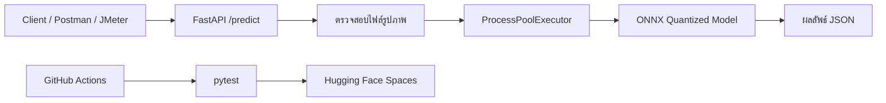

# ระบบจำแนกรูปภาพประสิทธิภาพสูงด้วย FastAPI และ MobileViT

โปรเจกต์นี้จัดทำขึ้นสำหรับรายวิชา MLOps โดยมีวัตถุประสงค์เพื่อพัฒนา API สำหรับจำแนกรูปภาพที่สามารถรองรับการเรียกใช้งานพร้อมกันได้ และมีการปรับแต่งโมเดลให้มีขนาดเล็กลงด้วย ONNX และ Dynamic Quantization

## สมาชิกกลุ่ม

- นายธนัสถ์ภณ อ่างทอง `1650901034`
- นายจีฮาน สุทธินิพนธ์นาม `1650904152`
- นายอกัณห์ เกษเพชร `1650904269`

## โมเดลที่ใช้

โมเดลที่ใช้ในโปรเจกต์นี้คือ `apple/mobilevit-small` จาก Hugging Face ซึ่งเป็นโมเดล Image Classification ที่ผสมแนวคิดของ CNN และ Transformer เข้าด้วยกัน จุดเด่นคือมีขนาดไม่ใหญ่มาก เหมาะกับงาน inference ที่ต้องการความเร็ว และสามารถนำไปใช้งานในระบบที่มีทรัพยากรจำกัดได้ดี

ในระบบจริง API จะเลือกใช้โมเดลเวอร์ชัน `ONNX Quantized` เป็นหลัก เพื่อช่วยลดขนาดไฟล์โมเดลและลดภาระการประมวลผลบน CPU

## ภาพรวมสถาปัตยกรรมระบบ



API พัฒนาด้วย FastAPI และใช้ `async def` สำหรับรับ request ส่วนงาน inference ซึ่งเป็นงานแบบ CPU-bound จะถูกส่งไปประมวลผลผ่าน `ProcessPoolExecutor` เพื่อป้องกันไม่ให้ API ค้างเมื่อมีการเรียกใช้งานพร้อมกันหลาย request

## โครงสร้างโปรเจกต์

```text
app/                  โค้ดหลักของ FastAPI
scripts/              สคริปต์สำหรับ export ONNX, quantization และ benchmark
tests/                ชุดทดสอบด้วย pytest
models/               ไฟล์โมเดลและผล benchmark
postman/              Postman Collection สำหรับทดสอบ API
jmeter/               JMeter Test Plan สำหรับทดสอบโหลด
.github/workflows/    Workflow สำหรับ CI/CD
```

## การติดตั้งและใช้งานบนเครื่อง

สำหรับ Windows PowerShell ให้ใช้คำสั่งดังนี้

```powershell
python -m venv .venv
.\.venv\Scripts\Activate.ps1
pip install -r requirements.txt
```

ไฟล์ `requirements.txt` ใช้สำหรับรัน API และ Docker ส่วนกรณีที่ต้องการ export โมเดล ทำ quantization หรือรัน unit test ให้ติดตั้ง dependencies เพิ่มเติมด้วยคำสั่ง

```powershell
pip install -r requirements-dev.txt
```

## การปรับแต่งโมเดล

สามารถรันสคริปต์สำหรับ export โมเดลเป็น ONNX, ทำ Dynamic Quantization และ benchmark ได้ด้วยคำสั่ง

```powershell
python scripts\optimize_model.py --runs 20
```

ขั้นตอนที่สคริปต์ดำเนินการประกอบด้วย

- ดาวน์โหลดหรือโหลดโมเดล `apple/mobilevit-small`
- แปลงโมเดลจาก PyTorch เป็น ONNX
- ทำ Dynamic Quantization เฉพาะ layer ประเภท `MatMul` และ `Gemm`
- ทดสอบ latency ของ PyTorch, ONNX และ ONNX Quantized
- บันทึกผลไว้ที่ `models/benchmark_results.json`

ผล benchmark ที่ได้จากการทดสอบบนเครื่องนี้มีดังนี้

- PyTorch: ขนาดโมเดล `21.44 MB`, latency เฉลี่ย `34.43 ms`, P95 `37.51 ms`
- ONNX: ขนาดโมเดล `21.49 MB`, latency เฉลี่ย `55.58 ms`, P95 `63.64 ms`
- ONNX Quantized: ขนาดโมเดล `11.56 MB`, latency เฉลี่ย `47.00 ms`, P95 `56.47 ms`

จากผลการทดสอบพบว่า ONNX Quantized สามารถลดขนาดไฟล์โมเดลลงได้ประมาณ 46% เมื่อเทียบกับ ONNX ปกติ และมี latency ดีขึ้นกว่า ONNX ปกติบนเครื่องที่ใช้ทดสอบ

## การรัน API ด้วย Docker

สร้าง Docker image ด้วยคำสั่ง

```powershell
docker build -t mobilevit-api .
```

รัน API ด้วยคำสั่ง

```powershell
docker run --rm -p 7860:7860 mobilevit-api
```

หลังจากรันคำสั่งนี้ API จะเปิดให้ใช้งานที่ `http://127.0.0.1:7860`

## ตัวอย่างการเรียกใช้งาน API

ตรวจสอบสถานะของระบบ

```powershell
curl.exe http://127.0.0.1:7860/health
```

เรียกใช้งาน endpoint สำหรับจำแนกรูปภาพ

```powershell
curl.exe -X POST "http://127.0.0.1:7860/predict?top_k=3" -F "file=@sample_images/benchmark.png"
```

ตัวอย่างผลลัพธ์ที่ได้

```json
{
  "model": "apple/mobilevit-small",
  "runtime": "onnx-quantized",
  "top_k": 3,
  "predictions": [
    {
      "label": "tabby, tabby cat",
      "score": 0.18672767281532288
    }
  ]
}
```

## การทดสอบระบบ

รัน unit test ด้วยคำสั่ง

```powershell
pytest -q
```

ชุดทดสอบที่จัดทำไว้ตรวจสอบประเด็นหลักดังนี้

- endpoint `/health` สามารถตอบกลับ JSON ได้ถูกต้อง
- endpoint `/predict` สามารถรับไฟล์รูปภาพและตอบกลับผลการทำนายได้
- endpoint `/predict` ปฏิเสธไฟล์ที่ไม่ใช่รูปภาพด้วย HTTP status code ที่เหมาะสม

ผลการทดสอบล่าสุด

```text
3 passed
```

## การทดสอบโหลดด้วย JMeter

โปรเจกต์มีไฟล์ JMeter Test Plan อยู่ที่

```text
jmeter/mobilevit-load-test.jmx
```

ก่อนรัน JMeter ต้องเปิด API ด้วย Docker ให้เรียบร้อยก่อน จากนั้นเปิดไฟล์ `.jmx` ใน Apache JMeter และกดปุ่ม Start เพื่อเริ่มทดสอบโหลด

ค่าที่ควรนำไปวิเคราะห์ในรายงาน ได้แก่

- จำนวน request ทั้งหมด
- Error %
- Throughput
- Average Latency
- P95 Latency

จากการทดสอบโหลดเบื้องต้นด้วย concurrent requests จำนวน 30 request และ concurrency 10 ได้ผลดังนี้

```text
success: 30/30
throughput: 10.32 requests/second
average latency: 874.90 ms
P95 latency: 1187.96 ms
```

## การจัดการ Error Handling

API มีการตรวจสอบ input และจัดการ error ที่สำคัญดังนี้

- กรณีไฟล์ไม่ใช่ JPEG, PNG หรือ WebP จะตอบกลับ `400 Bad Request`
- กรณีไฟล์ว่างเปล่า จะตอบกลับ `400 Bad Request`
- กรณีไฟล์เสียหรือไม่สามารถเปิดเป็นรูปภาพได้ จะตอบกลับ `400 Bad Request`
- กรณีไฟล์มีขนาดใหญ่เกินกำหนด จะตอบกลับ `413 Request Entity Too Large`
- กรณีเกิดข้อผิดพลาดระหว่าง inference จะตอบกลับ `500 Internal Server Error`

## CI/CD

ระบบ CI/CD ถูกกำหนดไว้ที่ไฟล์ `.github/workflows/ci-cd.yml` โดย workflow จะรัน unit test ทุกครั้งที่มีการ push หรือ pull request ไปยัง branch `main`

หากต้องการ deploy ไปยัง Hugging Face Spaces อัตโนมัติ ต้องกำหนด GitHub Secrets ดังนี้

- `HF_TOKEN` คือ Hugging Face access token
- `HF_SPACE_REPO_ID` คือชื่อ repository ของ Hugging Face Space เช่น `username/mobilevit-api`

## ตัวอย่าง cURL สำหรับ API บน Cloud

เมื่อ deploy ไปยัง Hugging Face Spaces แล้ว สามารถเรียกใช้งาน API ได้โดยเปลี่ยน URL เป็น URL ของ Space จริง

```powershell
curl.exe -X POST "https://YOUR-USERNAME-YOUR-SPACE.hf.space/predict?top_k=3" -F "file=@sample_images/benchmark.png"
```
