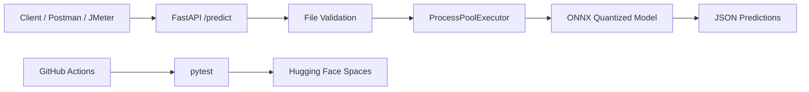

# High-Throughput Image Classification Service

FastAPI image classification service for the MLOps assignment using `apple/mobilevit-small` from Hugging Face.

## Team

- นายธนัสถ์ภณ อ่างทอง `1650901034`
- นายจีฮาน สุทธินิพนธ์นาม `1650904152`
- นายอกัณห์ เกษเพชร `1650904269`

## Model

The project uses `apple/mobilevit-small`, a lightweight image classification model that combines CNN-style local feature extraction with Transformer-style global context. It is a good fit for high-throughput CPU inference because it is smaller than many classic CNN baselines while keeping strong accuracy.

## Architecture



The API is asynchronous at the request layer and sends CPU-bound inference work to a process pool so concurrent requests do not freeze the server event loop.

## Project Structure

```text
app/                  FastAPI application
scripts/              ONNX export, quantization, and benchmark script
tests/                pytest API tests
models/               Generated model artifacts
postman/              Postman collection
jmeter/               JMeter load test plan
.github/workflows/    CI/CD workflow
```

## Local Setup

```bash
python -m venv .venv
source .venv/bin/activate
pip install -r requirements.txt
```

On Windows PowerShell:

```powershell
python -m venv .venv
.\.venv\Scripts\Activate.ps1
pip install -r requirements.txt
```

Use `requirements.txt` for API runtime and Docker. For model export, quantization, and tests, install the development dependencies:

```bash
pip install -r requirements-dev.txt
```

## Model Optimization

Run the optimization and benchmark script:

```bash
python scripts/optimize_model.py --runs 20
```

The script will:

- Download/use `apple/mobilevit-small`
- Export the model to ONNX
- Apply dynamic quantization to MatMul/Gemm layers
- Benchmark PyTorch, ONNX, and quantized ONNX
- Save results to `models/benchmark_results.json`

Use the JSON result in the project report to compare model size, average latency, and P95 latency for PyTorch, ONNX, and ONNX Quantized runtimes.

## Run API

```bash
uvicorn app.main:app --host 0.0.0.0 --port 7860
```

Health check:

```bash
curl http://localhost:7860/health
```

Prediction:

```bash
curl -X POST "http://localhost:7860/predict?top_k=5" \
  -F "file=@sample_images/benchmark.png"
```

## Docker

Build and run locally:

```bash
docker build -t mobilevit-api .
docker run --rm -p 7860:7860 mobilevit-api
```

Then call:

```bash
curl -X POST "http://localhost:7860/predict?top_k=5" \
  -F "file=@sample_images/benchmark.png"
```

## Tests

```bash
pytest -q
```

The tests verify:

- `/health` returns JSON
- `/predict` accepts a valid image and returns prediction JSON
- `/predict` rejects invalid file types with a client error

## CI/CD

The workflow in `.github/workflows/ci-cd.yml` runs tests on every push and pull request. On push to `main`, it deploys to Hugging Face Spaces if all tests pass.

Required GitHub secrets:

- `HF_TOKEN`: Hugging Face access token
- `HF_SPACE_REPO_ID`: Space repo id, for example `username/mobilevit-api`

For Hugging Face Spaces, create a Docker Space and push this repository. The `Dockerfile` starts the API on port `7860`.

## Load Testing

Run the API locally, then run JMeter:

```bash
jmeter -n -t jmeter/mobilevit-load-test.jmx \
  -Jhost=localhost \
  -Jport=7860 \
  -Jimage_path=sample_images/benchmark.png \
  -l jmeter/results/results.jtl \
  -e -o jmeter/report
```

Open `jmeter/report/index.html` and capture throughput, average latency, and P95 latency for the report.

## Error Handling

The API validates:

- Unsupported content type: `400 Bad Request`
- Empty file: `400 Bad Request`
- Corrupted or non-image file: `400 Bad Request`
- Oversized file: `413 Request Entity Too Large`
- Unexpected inference failure: `500 Internal Server Error`

## Cloud cURL Template

Replace the base URL with your Hugging Face Space URL:

```bash
curl -X POST "https://YOUR-USERNAME-YOUR-SPACE.hf.space/predict?top_k=5" \
  -F "file=@sample_images/benchmark.png"
```
